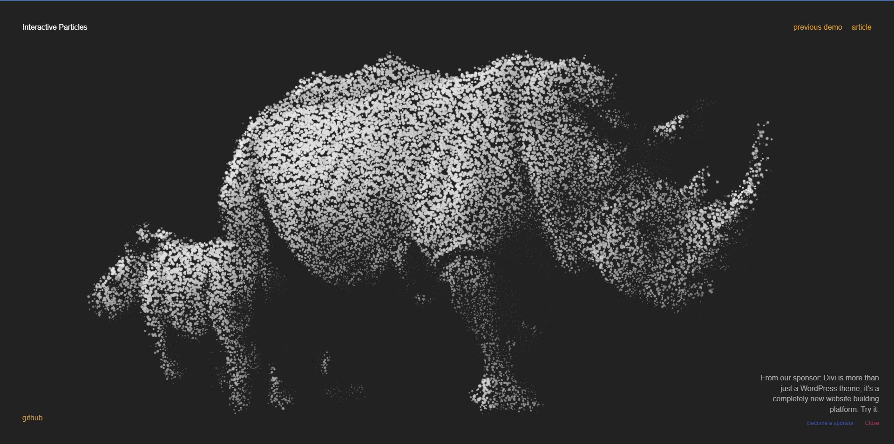
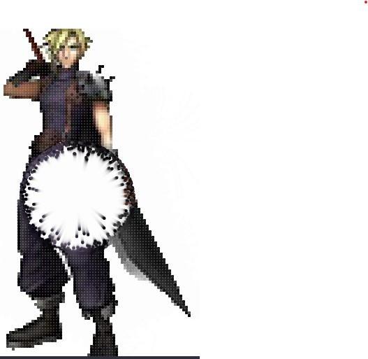
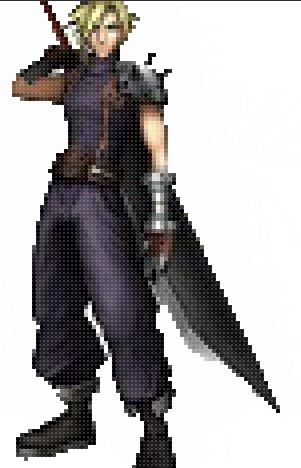

### zwan0231_9103_tut6

# Imaging Technique Inspiration

#### The most interesting thing for me is the function that can convert 2D pictures into 3D version. Users can also have interactions with images. Here are two sources of inspiration that I find interesting. 

> Particle effect
[tympanus.net](https://tympanus.net/Tutorials/InteractiveParticles/)

#### The particle effect on the picture can change the diffusion size based on the movement of the cursor.
#### This particle effect will also make the interactive feeling more intense.
> particle image
[tympanus.net](https://www.pinterest.com/pin/6051780741375593/)

#### _Consider about the final project, the particle images with diffusion effects can provide a good mouse interaction with user._

# Coding Technique Exploration

### There is only three main challenges:
* How to convert the image into 3D particle version
* How to make each particle change sizes themselves
* How t achieve the diffusion of the partcles when cursor move around

1. The coversion of the image can be achieve by making it pixelated and converted to png format so that it can be better used by web pages.
2. The particle sizes changing can be achieved by changing the radius of the particle based on the time , set a proper random range of the radius value. 
3. The diffusion and image conversion can be achieved by the code below
> Diffusion particle and coversion images
[Image into particles](https://codepen.io/franksLaboratory/pen/dyYGMwQ)
  

